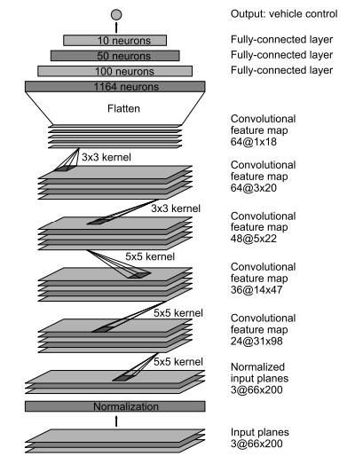
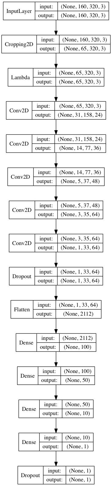
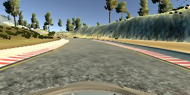
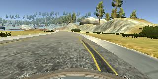
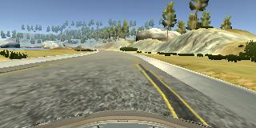
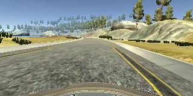
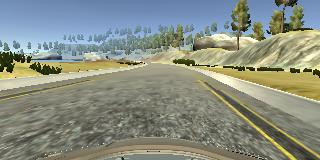
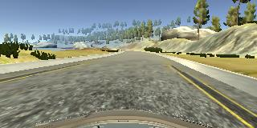
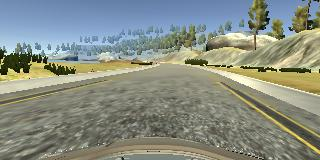
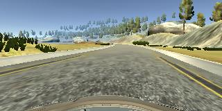

# Behavioral Cloning

## Rubric Points
### Required Files
Submission includes all required files and can be used to run the simulator in autonomous mode.  These files include:
* **model.py** - A script to create and train the model.
* **drive.py** - A script that drives the car in autonomous mode.
* **model.h5** - Contains a trained convolutional neural network.
* **writeup_report.md** - Summarizes the results for submission to Udacity.

### Quality of Code
The car can be driven autonomously using Udacity's self-driving car simulator.  To drive the car autonomously:
1. Open Udacity's self-driving car simulator and go to autonomous mode.
2. Run the following:
    ```sh
    python drive.py models/model.h5
    ```

The model.py script contains all the code that created the model.  Due to memory issues, I created a generator that reads a `batch_size` number of lines from the CSV, reads the images from the directory and feeds those images (and their respecive angles) to the data generator.

### Model Architecture and Training Strategy
My model consists of a neural network modeled after [NVIDIA's DaveNet](https://arxiv.org/pdf/1604.07316v1.pdf).

### NVIDIA's architecture


### My architecture


The cropping layer crops the top and bottom of the images as those portions do not add any relevant information.  The lambda layer is a normalization layer.  The convolutional layers include ReLU layers.  Dropout layers with a dropout rate of 0.3 were used twice, once after the last convolutional layer and once at after the output layer.  This prevented overfitting.

An Adam optimizer was used so the learning rate was not tuned manually.

### Model Design
I began by creating a convolutional neural network model similar to the LeNet model.  I found this model appropriate as I successfully used it with my  [traffic signs project](https://github.com/AryanJ-NYC/CarND-Traffic-Sign-Classifier-Project/).

I collected data using Udacity's self-driving car simulator.  I began with two laps of center lane driving around the track.  I split this data into training and validation data (dedicating 20% of the data to a validation set).  The model had a low mean squared error on the training set and a validation set.

However, I found the self-driving car successfully drove straight (though along the right lane line) but struggled around curves.  After reading NVIDIA's [End to End Learning for Self-Driving Cars](https://arxiv.org/pdf/1604.07316v1.pdf), I gathered more data that represented curves.  I also looked to gather recovery data (data that trained the car how to recover when driving along a lane line).  Lastly, I changed my from the LeNet model to the model used in the paper (as a challenge to myself).

With the additional data, my self-driving car successfully made it to the second to last curve.  However, it failed to make such a sharp turn.  I  gathered additional data with respect to this turn.

With this last bit of data, the car is able to drive autonomously around the track without leaving the road.

To capture good driving behavior, I recorded two laps on track one using center lane driving:


I then recorded the vehicle recovering from the left and right sides of the road back to the center:








I had 28260 images total dedicating 22608 as training images and 5652 as validation images.

The data set was randomly shuffled prior to data generation.  Each batch was also randomly shuffled.

A video of the vehicle's successful lap around the course can be found [on YouTube](https://www.youtube.com/watch?v=Bco18aQMIlw).
